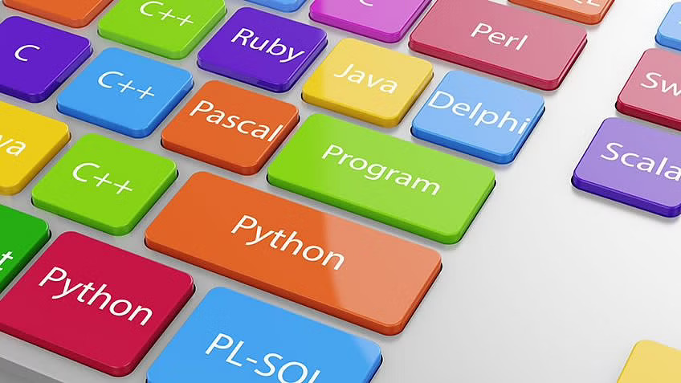

<!-- Readme Start here -->

<!-- Load logo from readme/logo.jpg -->

  

<!-- Title -->
<h1 align="center" style="border: none">
CECS 524 Collection
</h1>

<!-- Shield IO - very nice icons -->

[![Contributors][contributors_shield]][contributors_url]
[![Forks][forks_shield]][forks_url]
[![Stargazers][stars_shield]][stars_url]
[![Issues][issues_shield]][issues_url]
[![MIT License][license_shield]][license_url]
[![LinkedIn][linkedin_shield]][linkedin_url]

<!-- Description -->
Analyze multiple programming languages including their syntax and semantics and existing tools used to parse and compile such languages.

<!-- Include your major tools and frameworks -->
## Built With
- [C++]
- [Java]
- [Assembly]
- [Python]
- [ANTLR]
- [Ada]

<!-- Collaborators information -->
## Collaborators
- [Sotheanith Sok]

## Course
- [CECS 524 - Advanced Topics in Programming Languages]

<!-- License -->
## License
This project is licensed under the MIT License - see the [LICENSE.md][license_url] file for details

<!-- Shoutout to other projects, plugin, or minor tools -->
## Acknowledgments
Special thank to
- [Best-README-Template] - the readme template.

<!-- References -->
<!-- Shield Icons-->
[contributors_shield]: https://img.shields.io/github/contributors/sotheanithsok/CECS-524-Collection.svg?style=for-the-badge
[forks_shield]: https://img.shields.io/github/forks/sotheanithsok/CECS-524-Collection.svg?style=for-the-badge
[stars_shield]: https://img.shields.io/github/stars/sotheanithsok/CECS-524-Collection.svg?style=for-the-badge
[issues_shield]: https://img.shields.io/github/issues/sotheanithsok/CECS-524-Collection.svg?style=for-the-badge
[license_shield]: https://img.shields.io/github/license/sotheanithsok/CECS-524-Collection.svg?style=for-the-badge
[linkedin_shield]: https://img.shields.io/badge/-LinkedIn-black.svg?style=for-the-badge&logo=linkedin&colorB=555

<!-- Shield URLs -->
[contributors_url]: https://github.com/sotheanithsok/CECS-524-Collection/graphs/contributors
[forks_url]: https://github.com/sotheanithsok/CECS-524-Collection/network/members
[stars_url]: https://github.com/sotheanithsok/CECS-524-Collection/stargazers
[issues_url]: https://github.com/sotheanithsok/CECS-524-Collection/issues
[license_url]: https://github.com/sotheanithsok/CECS-524-Collection/blob/master/LICENSE
[linkedin_url]: https://www.linkedin.com/in/sotheanith-sok-969ab0b3/

<!-- Other links -->
[Sotheanith Sok]: https://github.com/sotheanithsok
[Best-README-Template]: https://github.com/othneildrew/Best-README-Template

[C++]: https://www.cplusplus.com/
[Java]: https://www.oracle.com/java/technologies/javase-downloads.html
[Assembly]: https://en.wikipedia.org/wiki/MS-DOS
[Python]: https://www.python.org/
[ANTLR]: https://www.antlr.org/
[Ada]: https://en.wikipedia.org/wiki/Ada_(programming_language)
[CECS 524 - Advanced Topics in Programming Languages]: http://catalog.csulb.edu/preview_course_nopop.php?catoid=5&coid=40027
